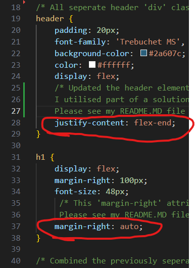

# Coding Bootcamp Challenge 1 - Code Refactor by Isaac Fallon

## Description

This project is a code refractor task for the marketing agency Horiseon. It serves as the week 1 challenge for The University of Sydney's Coding Bootcamp.

- The motivation for completing this project was to ensure that the codebase provided was cleaned up to be as accessible as possible for both future developers and users interacting with the page. 
- This project was completed in order to fix several accessibility problems with the codebase as it was provided. 
- The problem solved by refactoring the codebase is that the page is now accessible for developers who may need to alter the codebase in the future and for users accessing the page, especially if they require the assistance of a page reader. 
- My biggest learning from completing this project was understanding the importance of keeping other developers and the end user in mind when writing code. By staying in this frame of mind and thinking about how others would use my work, it resulted in a more accessible product and tool. 

Below shows a screenshot of my completed webpage as it appears to the user accessing the website:


## Installation

N/A

## Usage

### Usage Method 1: Access the website via GitHub Pages

If you want to simply access the page easily and without hassle, [visit the working GitHub Pages link here](https://isaacfallon.github.io/1-Challenge-Code-Refactor-Horiseon/) or by accessing the full link below:

https://isaacfallon.github.io/1-Challenge-Code-Refactor-Horiseon/

### Usage Method 2: Clone the project locally

Alternatively, you can clone the repository and run the project locally by following these steps:

1. Ensure Git is installed on your computer and/or download the latest version.
[View this git install guide if you need help.](https://github.com/git-guides/install-git/)
2. Clone the [repository](https://github.com/isaacfallon/1-Challenge-Code-Refactor-Horiseon) by pressing the green 'code' button and select either HTTPS or SSH depending on your preferences. 
3. Open your command line of choice and enter the following code: 

   ```md
    git clone [HTTPS or SSH key copied here]
    ```

4. Navigate to the cloned folder and access the website by either opening the index.html file in your browser of choice or opening the codebase in your code editor of choice and opening the index.html file in a live window. 

## Credits

My CSS codebase utilises a very small snippet of code found on a Stack Overflow answer [linked here](https://stackoverflow.com/questions/30553602/flexbox-justify-left-and-right-on-the-same-line) by user 'mmgross'. 

Screenshot of the answer sourced below:


The relevant code is used in my styles.css file on lines 28 and 37. 

Please see a screenshot below showing these locations circled within the CSS codebase:



The purpose of using this code was to ensure that the child elements with my header tag (h1 and nav) could use the same horizontal space but be aligned on opposite sides of the header space. 

## License

MIT License

Copyright (c) 2024 isaacfallon

Permission is hereby granted, free of charge, to any person obtaining a copy
of this software and associated documentation files (the "Software"), to deal
in the Software without restriction, including without limitation the rights
to use, copy, modify, merge, publish, distribute, sublicense, and/or sell
copies of the Software, and to permit persons to whom the Software is
furnished to do so, subject to the following conditions:

The above copyright notice and this permission notice shall be included in all
copies or substantial portions of the Software.

THE SOFTWARE IS PROVIDED "AS IS", WITHOUT WARRANTY OF ANY KIND, EXPRESS OR
IMPLIED, INCLUDING BUT NOT LIMITED TO THE WARRANTIES OF MERCHANTABILITY,
FITNESS FOR A PARTICULAR PURPOSE AND NONINFRINGEMENT. IN NO EVENT SHALL THE
AUTHORS OR COPYRIGHT HOLDERS BE LIABLE FOR ANY CLAIM, DAMAGES OR OTHER
LIABILITY, WHETHER IN AN ACTION OF CONTRACT, TORT OR OTHERWISE, ARISING FROM,
OUT OF OR IN CONNECTION WITH THE SOFTWARE OR THE USE OR OTHER DEALINGS IN THE
SOFTWARE.

